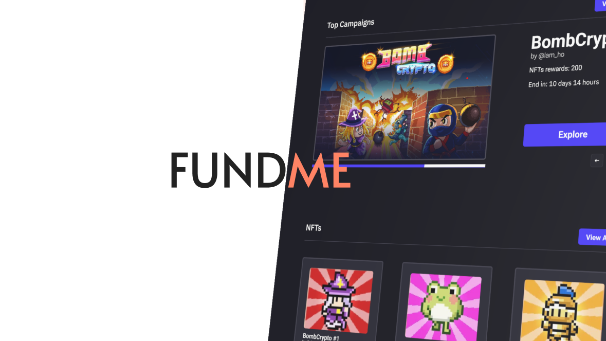
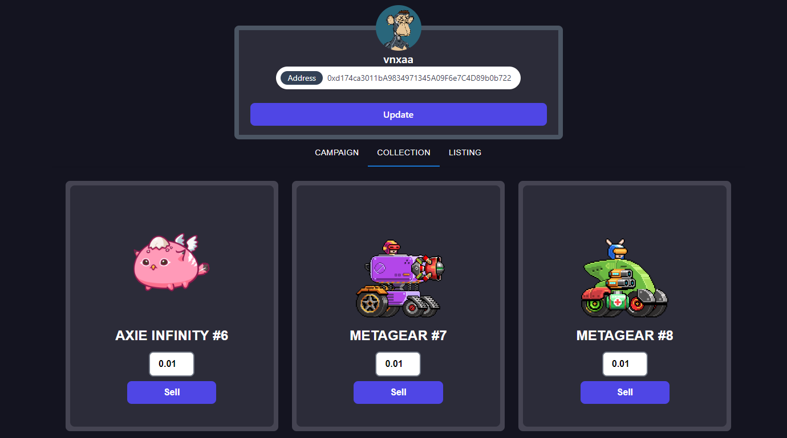
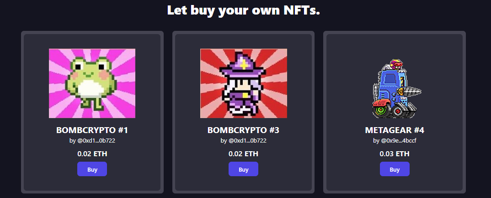
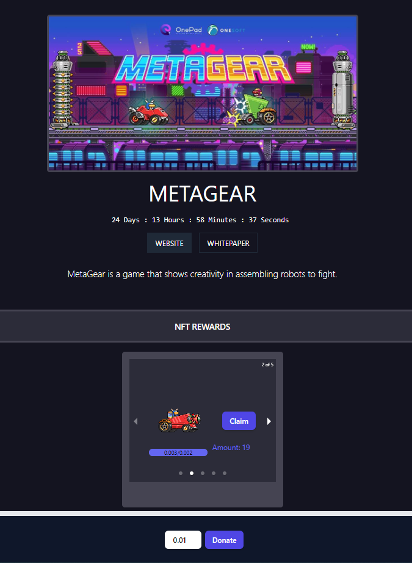

<p align=center>

</p>

[](https://github.com/tterb/atomic-design-ui/blob/master/LICENSEs)
[](https://opensource.org/licenses/)
[](http://www.gnu.org/licenses/agpl-3.0)


This project is a crowdfunding platform application that uses [OpenZepplin](https://github.com/OpenZeppelin/openzeppelin-solidity).


The contract is compiled and deployed under the ERC-721 non-fungible token standard with hardhat framework. After deploying onto the Ethereum blockchain, users will be able to use this application by interacting with the smart contract through DAPP’s front-end interface.

# ERC-721 Token

ERC-721 non-fungible token:
    ERC-721 is a free, open standard that describes how to build non-fungible or unique tokens on the Ethereum blockchain. While most tokens are fungible (every token is the same as every other token), ERC-721 tokens are all unique (with unique ID).

[Reference](https://github.com/ethereum/EIPs/blob/master/EIPS/eip-721.md)

# Contracts
You can find contract detail under `contracts/` directory:
- [`Fundme.sol`](./contracts/Fundme.sol):
    The implementation of smart contract.

# Tech Stack

**Client:** NextJs, TailwindCSS, Hardhat, MetaMask 

**Server:** NodeJs, ExpressJs, MongoDB, Firebase

**Blockchain:** Etherscan 

# Installation

Install Fundme front-end:

```bash
  npm install
  npx hardhat compile
  npm run dev
```

Install Fundme back-end: [Fundme back-end](https://github.com/vnxaa/fundme_be)
```bash
  npm install
  npm run dev
```

# Playground

We already deployed contracts to [Rinkeby](https://rinkeby.etherscan.io/) network. You can play with them RIGHT NOW.

| Contract         | Token address | Transaction hash
|------------------|---------------|---------------------
| Fundme  | [0xa3f16aDccbbd7012489ee3c117Ce52531050dfFc](https://rinkeby.etherscan.io/address/0xa3f16adccbbd7012489ee3c117ce52531050dffc) | [0xf358d04dcae1fbc45c178c69e36ea9cc12efae15fbc78dd5080211cec66c95ac](https://rinkeby.etherscan.io/tx/0xf358d04dcae1fbc45c178c69e36ea9cc12efae15fbc78dd5080211cec66c95ac)


# Screenshots

## Profile

<p align=center>

</p>

## Marketplace

<p align=center>

</p>

## Campaign

<p align=center>

</p>


# Authors

- [@vnxaa](https://github.com/vnxaa)

- [@aresgowar](https://github.com/aresgowar)


# Support

For support, email vnxa01@gmail.com.
